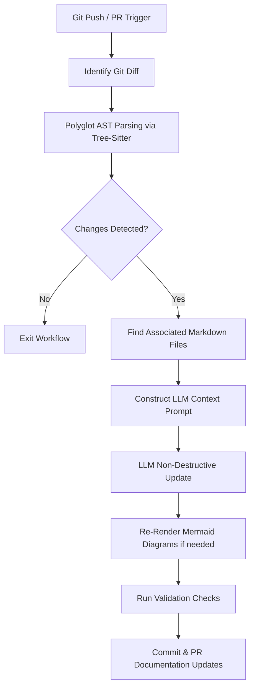

# Workflow: Auto-Documentation Maintenance

This workflow governs how the DocuFlow Agent automatically maintains code documentation, API references, and architecture diagrams based on code modifications.



---

## 🛠️ Step-by-Step Execution

### Step 1: Detect Changes
*   **Trigger**: Triggered via local pre-commit hook or CI/CD workflow (e.g., GitHub Actions on pull request).
*   **Action**: Runs `git diff` against the main/target branch.
*   **Artifacts**: List of files changed, added, or deleted.

### Step 2: Build Polyglot Code Context
*   **Action**: Detect the framework (Python, C#/.NET, Angular, Flutter).
*   **Action**: For every changed source file, run the appropriate `tree-sitter` language parser to detect structural modifications:
    *   New/removed endpoints in route controllers.
    *   Changes to public function signatures, parameters, or return types.
    *   New class structures, interfaces, or decorators/attributes.
*   **Action**: Locate existing `.md` files that reference the modified classes/files (using string matching or configuration mapping from `docuflow.toml`).

### Step 3: Prompt & LLM Execution
*   **Action**: Package the existing markdown file, the raw code diff, the extracted AST structures, and the `documentation_rules.md` into the agent's prompt context.
*   **Prompt Template**:
    ```text
    You are the DocuFlow Agent. Your job is to update the following markdown documentation based on the provided code diff.
    Rules:
    - Follow all documentation_rules.md strictly.
    - Only modify, add, or delete details that directly correspond to the code changes.
    - Do not modify surrounding unrelated documentation.
    - Keep formatting intact.
    
    Existing Doc: [insert existing doc]
    Code Diff: [insert diff]
    ```

### Step 4: Visual Architecture Sync (Optional)
*   **Action**: If the structural changes affect top-level module directories or data flows, retrieve the associated Mermaid diagram code.
*   **Action**: Direct the LLM to update only the Mermaid code block inside the markdown file to represent the updated structural flow.

### Step 5: Verification & Commit
*   **Action**: Run lint/parser checks on the newly updated markdown file. Validate that the Mermaid diagram syntax is correct.
*   **Action**: Write the changes back to disk. If running in CI/CD, commit the documentation updates back to the branch or submit a PR.
