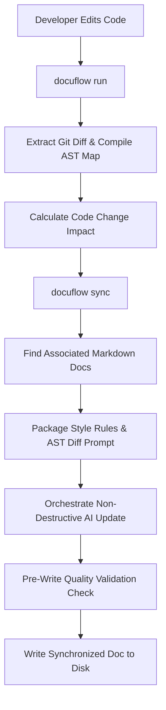

# DocuFlow

DocuFlow is a command-line tool that automatically maintains your technical markdown documentation in sync with Python source code changes. It extracts code structures using native AST parsing, matches modified modules to associated documents, and updates them contextually using AI providers (Gemini or OpenAI).

It also includes a local markdown checker to enforce formatting rules and a terminal viewer for styled in-console document browsing.

---

## Features

- **AST Code Impact Analysis**: Compares your local modified code against a Git base branch using Python's native AST parser. It identifies precisely which classes, sync/async methods, signatures, docstrings, or parameters were added, modified, or removed.
- **AI Document Synchronization**: Automatically locates and matches related markdown files using a casings-insensitive matching heuristic. It merges code structural changes into your technical docs without destroying custom manual sections.
- **Rule Enforcement Checker**: Validates that all technical documents comply with repository standards (single H1 title, no placeholder TODOs, correct code block highlighting tags, and quoted Mermaid nodes).
- **In-Console Markdown TUI**: Renders technical markdown documents directly inside the terminal with boxed tables and styled blocks using `rich`.
- **CI/CD Integration**: Supports running documentation checks automatically inside GitHub Actions pipelines.

---

## Architecture



---

## Installation

Install the package directly from PyPI:

```bash
pip install docuflow
```

---

## Commands Guide

### 1. Initialize Configuration
Generate the default `docuflow.toml` configuration and set up the `/docs` folder:
```bash
docuflow init
```

### 2. Audit Document Compliance
Verify that all technical documents comply with repository styling guidelines:
```bash
docuflow check
```

### 3. Analyze Code Changes
Compare local changes against the base branch and report structural AST impact:
```bash
docuflow run
```

### 4. Preview Sync Prompts (Dry-Run)
Inspect what context and prompts will be sent to the AI engine without executing network requests:
```bash
docuflow sync --dry-run
```

### 5. Execute Documentation Sync
Synchronize matched documents with current code changes using your configured AI engine:
```bash
export GEMINI_API_KEY="your-api-key"
docuflow sync
```

### 6. Read Technical Docs in Console
Render technical markdown files directly in the terminal:
```bash
docuflow view docs/sample_api.md
```

---

## Configuration (`docuflow.toml`)

Customize project paths and settings in your configuration file:

```toml
[project]
name = "my_project"
watch_dirs = ["src"]
rules_path = ".agents/rules/documentation-rules.md"

[documentation]
docs_dir = "docs"

[git]
target_branch = "origin/main"
include_staged = true
include_unstaged = true

[ai]
provider = "gemini" # Options: "gemini", "openai"
model = "gemini-1.5-pro" # Options: "gemini-1.5-pro", "gpt-4o"
temperature = 0.2
max_tokens = 2000
```

---

## License

This project is licensed under the MIT License - see the [LICENSE](LICENSE) file for details.
